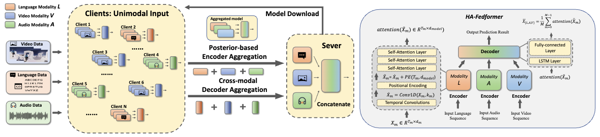

# Unimodal Training-Multimodal Prediction: Cross-modal Federated Learning with Hierarchical Aggregation [**[Arxiv]**](https://arxiv.org/pdf/2303.15486)
Rongyu Zhang, Xiaowei Chi, Wenyi Zhang, Guiliang Liu, Dan Wang, Fangxin Wang



## Installation

### Prerequisites
- Python 3.6/3.7
- [Pytorch (>=1.0.0) and torchvision](https://pytorch.org/)
- CUDA 10.0 or above

### Datasets

Data files (containing processed MOSI, MOSEI and IEMOCAP datasets) can be downloaded from [here](https://www.dropbox.com/sh/hyzpgx1hp9nj37s/AAB7FhBqJOFDw2hEyvv2ZXHxa?dl=0).
  
I personally used command line to download everything:
~~~~
wget https://www.dropbox.com/sh/hyzpgx1hp9nj37s/AADfY2s7gD_MkR76m03KS0K1a/Archive.zip?dl=1
mv 'Archive.zip?dl=1' Archive.zip
unzip Archive.zip
~~~~

To retrieve the meta information and the raw data, please refer to the [SDK for these datasets](https://github.com/A2Zadeh/CMU-MultimodalSDK).

### Run the Code

1. Create (empty) folders for data and pre-trained models:
~~~~
mkdir data pre_trained_models
~~~~

and put the downloaded data in 'data/'.

2. Command as follows
~~~~
python main.py --MCMCtrain [--FLAGS]
~~~~

## Citation
Please cite our work if you find it useful.
```bibtex
@article{zhang2023unimodal,
  title={Unimodal Training-Multimodal Prediction: Cross-modal Federated Learning with Hierarchical Aggregation},
  author={Zhang, Rongyu and Chi, Xiaowei and Liu, Guiliang and Zhang, Wenyi and Du, Yuan and Wang, Fangxin},
  journal={arXiv preprint arXiv:2303.15486},
  year={2023}
}
```

### Acknowledgement
Some portion of the code were adapted from the [MulT](https://github.com/yaohungt/Multimodal-Transformer) repo.
